# Node.js Chat with a Microservices Architecture

This project has been developed with a Microservices architecture

## Microservices

All Microservices communicate via **service-registry**, **Redis** and **RabbitMQ**

- app
- service-registry
- user-service
- bot-service
- chat-service

### Prerequisites

For the execution of this project it is necessary to have Docker installed, and share the folder where the project is in the Docker configuration.

[Docker for Mac](https://docs.docker.com/docker-for-mac/install/)

[Docker for Windows](https://docs.docker.com/docker-for-windows/install/)

### Installing

After having installed docker we proceed to execute the following command:

```bash
cd folder_project
docker-compose up -d mongo rabbitmq redis serviceregistry userservice botservice chatservice app
```

> **Note:** It is important to wait until all Services be up

### Running

Load [localhost](http://localhost:3000/)

### Description

The first time Docker is executed it may take a long time to load as it needs to download the virtual images of the OS for each container. After that it'll install all the libraries for the package and only then it runs the Docker. This time may vary depending on speed connection and hardware. To get the current status of the docker I recommend executing the following commands:

```bash
docker ps
```

It allows me to get a list of all the containers and their status.

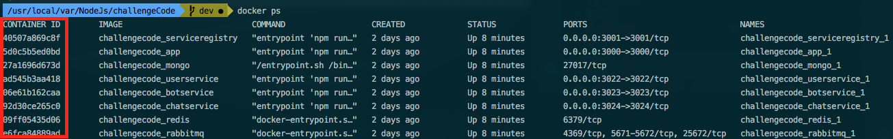

Once I have gotten all the identifiers for the containers (these always change) I can proceed to check the log of the two more important. The first one is the service-registry which tracks all the microservices available and allows their access. (I used Semver as a version manager which allows me to request a specific version of a service. This can be useful if you want to implement new versions of a service and they can be executed in pararell with older/different versions). Each microservice sends independently a signal state to be updated in the service-registry, also, if for some reason the service is shut down it'll send a notification to be removed from the list of available services. If the signal of a service is not delivered it will be removed from the list as well.

For this case I do:

```bash
docker logs -f 40507a869c8f
```


Here it shows the log from the service-registry which shows me that "bot-service, chat-service and user-service" are up and running.

Finally, I check the logs from the app container

```bash
docker logs -f 5d0c5b5ed0bd
```

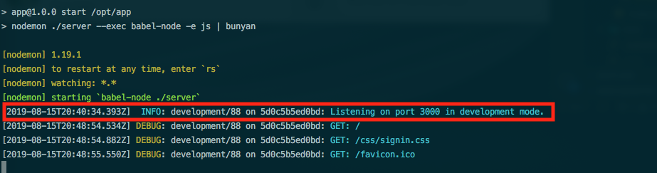

When the log shows "INFO: development/88 on 5d0c5b5ed0bd: Listening on port 3000 in development mode." it means that the service is running and I can access <http://localhost:3000/>

When I try and access the URL I can see it's working.

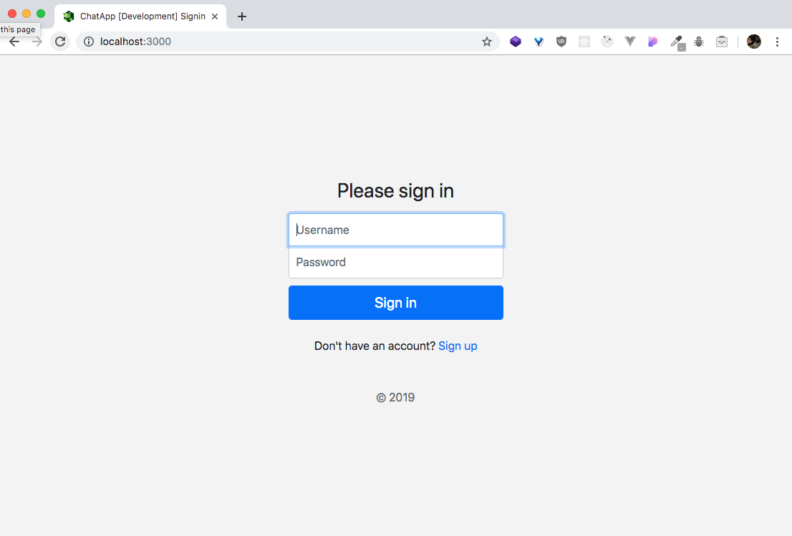

If it's the first time using the app you must create an account following the Sign Ip link.

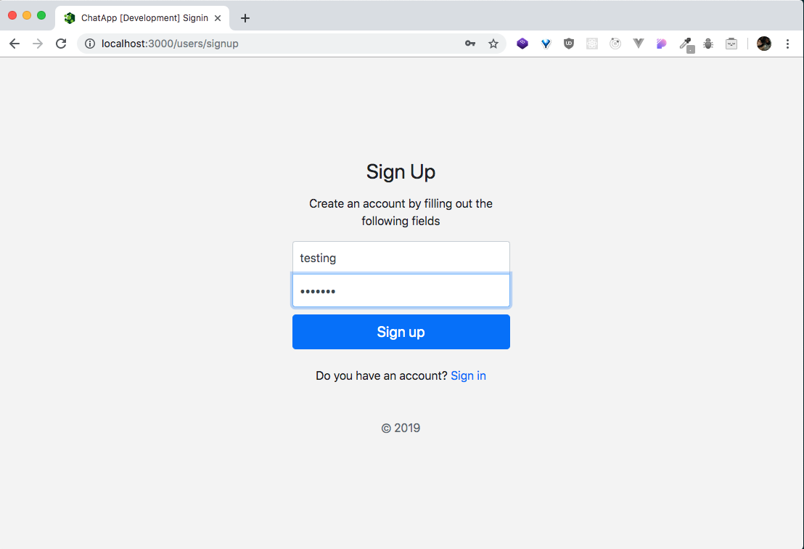

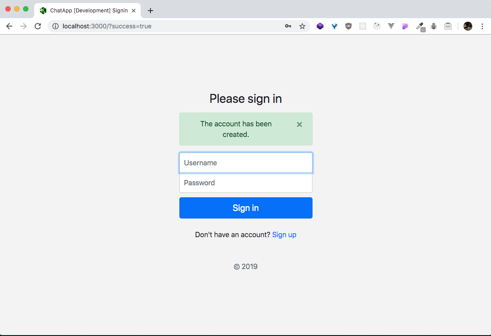

Once the account is created you can log in using your credentials. You'll be taken to the Rooms page. They're all store in the database.

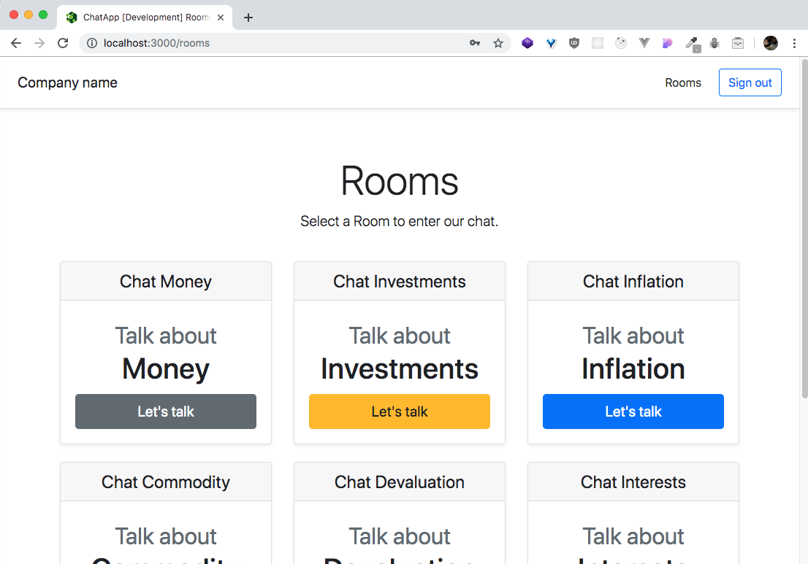

In the image below I show a chat from a Room viewed by 2 different users. you can post messages as commands into the chatroom with the following format: "/stock=APPL.US" then a bot will return a stock quote, all invalid commands are handled. In the first execution the command is valid and it retrieves the data with the requested format. In the second value the stock value is wrong, in the last execution the command is completely invalid as it is not recognized by the app so I used colors to be exact with the type of error.

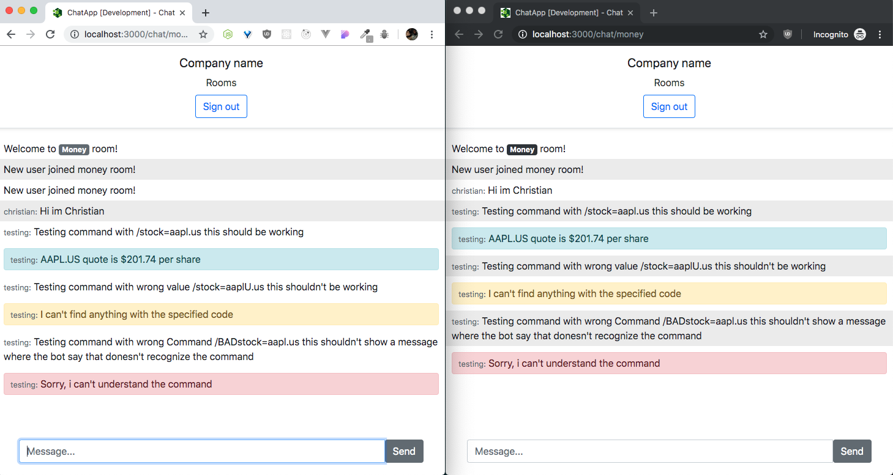

I used a design pattern called Circuit Breaker which is often used on microservice architectures. This design assures me that the application will continue to run in cases where one of the services can't be reached and instead of getting stuck loading it will respond with a pre-defined action. In this case it works to load the Rooms and the messages. If for some reason the service does not deliver the data the circuit opens up and and delivers the information previously cached. You can try stopping the chat service after a first working test. It'll keep sending the rooms and the messages even though the service isn't working, then after some time of "cooling" the circuit will check if the service is running and will proceed to get data again.


About axios, it's in charge of sending the requests, in the circuit breaker, it gets data from the microservice. In the folder called App there is a Service called "Chat.js". Using the method getRooms in line 18, it does a call to the chat-service. First it calls the getService which sends a request to the service-registry to obtain the url available for the chat service. After getting the service with the version request it, it proceeds to get the data using the circuit breaker mentioned above.

Views can be found inside App/Views. For the UI I simply used bootstrap's CDN and as language templated I used "EJS".

Here I show a sample of the chat-service running in two instances at the same time and how the service-registry is able to handle both of them.

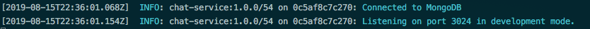

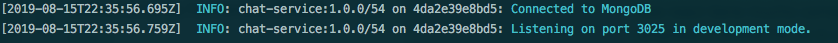

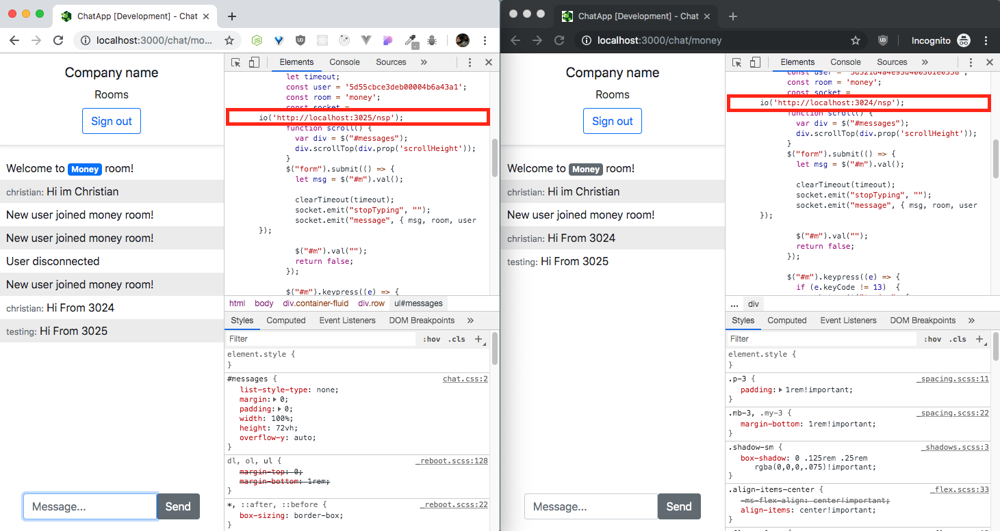

In this image you can see that the service-registry delivered the locations for the chat-service running in two independent services which allows us to replicate and have better performance.

Sample of the CircuitBreaker working. After shutting down the two services for the chat, at the moment of doing requests for the available rooms it keeps showing the rooms it has cached and keeps the page away from getting stuck loading data or showing no content.

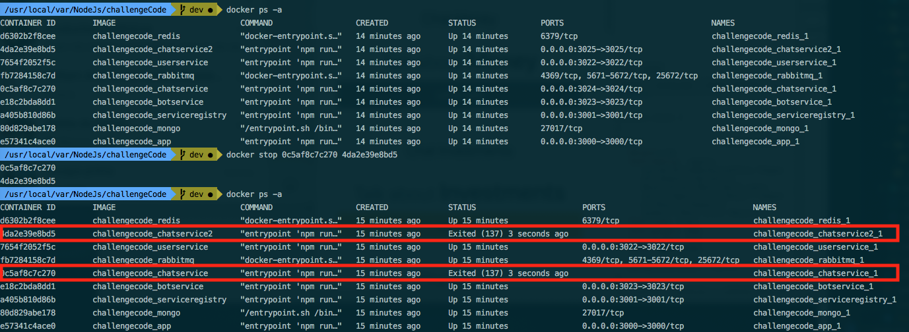

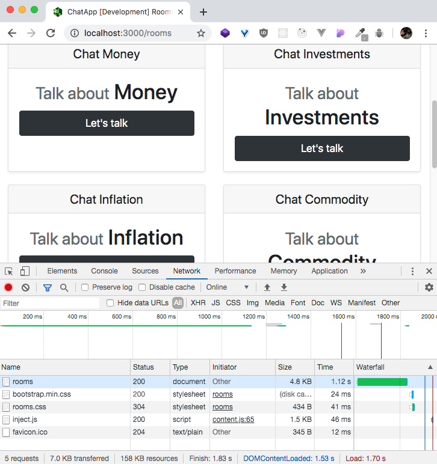

Here is the user-service tests.

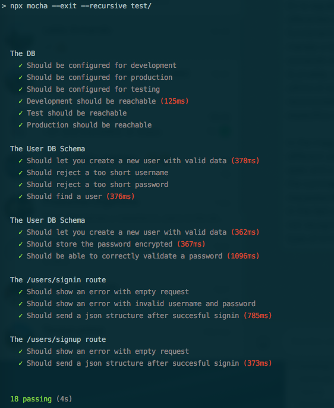

## Authors

- **Christian David Ibarguen R**
  <https://christianibarguen.com/>
